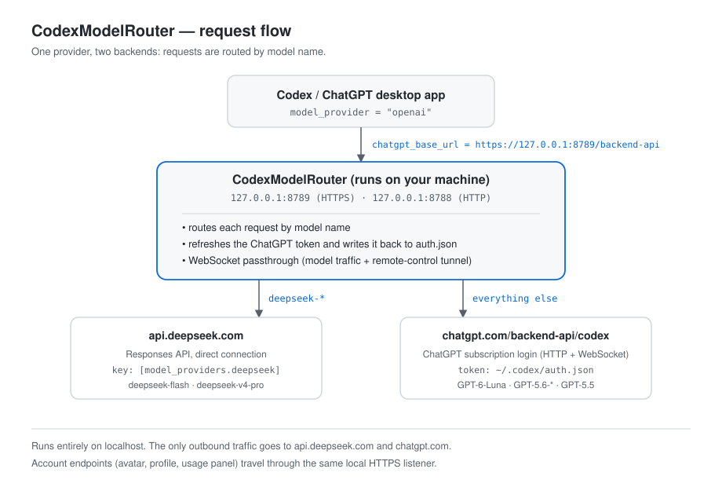

# CodexModelRouter

**Use DeepSeek and your ChatGPT-login models side by side in the Codex desktop app — one model picker, one provider, no config juggling.**

[English](README.md) · [简体中文](README.zh-CN.md)

[](LICENSE)
[](#requirements)
[](#development)

`CodexModelRouter` is a small, dependency-free local HTTP/HTTPS server that sits between the Codex
desktop app and the model providers. Codex keeps using its built-in `openai` provider, so the
account UI keeps working — while the router decides, per request, whether a model is served by
DeepSeek or by the ChatGPT backend.



## Why this exists

- Codex's model picker switches the **model name**; the **provider** is a global setting. You
  cannot normally mix a DeepSeek-powered model and a ChatGPT-subscription model in one picker.
- ChatGPT login mode speaks a proprietary protocol (`chatgpt.com/backend-api/codex`, Responses API
  over HTTP *and* WebSocket). Generic multi-provider gateways such as LiteLLM cannot proxy it,
  because they expect OpenAI-compatible API keys.
- Pointing `chatgpt_base_url` at a local server requires HTTPS plus a locally trusted certificate —
  which is exactly what this project provides.

The result: `deepseek-flash` and `gpt-5.6-luna` can live next to each other in the same dropdown.

## Architecture

```
Codex / ChatGPT desktop app
        │  chatgpt_base_url = https://127.0.0.1:8789/backend-api
        ▼
CodexModelRouter.exe            ── deepseek-*       → api.deepseek.com
 127.0.0.1:8789 HTTPS           ── everything else  → chatgpt.com/backend-api/codex
 127.0.0.1:8788 HTTP (legacy)
```

| Component | Role |
| --- | --- |
| `router.py` | The whole router: routing, token refresh, WebSocket passthrough, WS→SSE bridge for DeepSeek. Standard library only. |
| HTTPS listener (`8789`) | Terminates TLS with a locally generated CA, because Codex requires an HTTPS `chatgpt_base_url`. |
| HTTP listener (`8788`) | Kept for conversations pinned to the older custom-provider setup. |
| `auth.json` | ChatGPT login tokens. The router refreshes them automatically on HTTP 401 and writes them back. |

## Requirements

- Windows 10/11
- Codex (ChatGPT) desktop app, signed in with a ChatGPT account
- Python 3.11+ (to generate certificates and to build the executable)
- A DeepSeek API key
- Optional: a system HTTP proxy, if your network needs one to reach `chatgpt.com`

## Quick start

```powershell
git clone https://github.com/<your-user>/CodexModelRouter.git
cd CodexModelRouter
powershell -ExecutionPolicy Bypass -File install.ps1
```

`install.ps1` performs every step and prints the config snippet at the end:

1. generates a local CA + server certificate (`make-tls-cert.py`),
2. trusts the CA in *Current User → Trusted Root Certification Authorities*,
3. creates `browser-header-paths.txt` with a safe default,
4. builds `CodexModelRouter.exe` (PyInstaller),
5. registers the logon scheduled task and starts the router.

Then add this to `%USERPROFILE%\.codex\config.toml`:

```toml
model_provider = "openai"
chatgpt_base_url = "https://127.0.0.1:8789/backend-api"
model_catalog_json = "~/.codex/models.json"

[model_providers.deepseek]
base_url = "http://127.0.0.1:8788/"
wire_api = "responses"
experimental_bearer_token = "sk-your-deepseek-key"
```

Make sure `~/.codex/models.json` lists both families of models, then restart the app.

## Manual setup

```powershell
python make-tls-cert.py                                                    # 1. certificates
Import-Certificate tls\ca.crt -CertStoreLocation Cert:\CurrentUser\Root    # 2. trust the CA
powershell -ExecutionPolicy Bypass -File build-exe.ps1                     # 3. build (optional)
schtasks /create /tn CodexModelRouter /xml task-template.xml /f            # 4. autostart (edit paths first)
start-router.cmd                                                           # 5. run
```

## Daily use

- **Autostart**: the `CodexModelRouter` scheduled task runs at logon and re-checks every 5 minutes.
- **Start / stop manually**: `start-router.cmd` / `stop-router.cmd`.
- **Logs**: `router.log`, one JSON line per request (leg, model, status, bytes, duration, proxy).
- **Do not kill `CodexModelRouter.exe`**: it is the only path model requests can take. Killing it
  makes Codex look "logged out" or unable to send messages until the task restarts it.

## Configuration

| Setting | Default | Notes |
| --- | --- | --- |
| `ROUTER_PORT` | `8788` | HTTP listener (legacy provider). |
| `ROUTER_TLS_PORT` | `8789` | HTTPS listener used by `chatgpt_base_url`. |
| `ROUTER_PROXY` | *(system proxy)* | `none` forces direct connections; `host:port` forces a specific proxy. |
| `ROUTER_UPSTREAM_TIMEOUT` | `900` | Upstream socket timeout in seconds. |
| `browser-header-paths.txt` | `/backend-api/profiles/me` | Path prefixes that get browser-like request headers (see below). |

## Design notes and known trade-offs

1. **Cloudflare and the profile endpoints.** Some account endpoints
   (`/backend-api/profiles/me`, `/settings/user`, …) return 403 to clients whose request headers do
   not look like a browser. `browser-header-paths.txt` lists the paths that may use browser-like
   headers. It is re-read on every request, so edits apply instantly — no restart needed.
2. **Free accounts with exhausted quota.** If *all* account endpoints are proxied, Codex learns that
   the Codex quota is used up and disables the send button — even when the selected model is
   DeepSeek. That is why the default allow-list only covers the avatar/profile endpoint.
   Restore it once the quota resets or the account is upgraded.
3. **Remote control (phone ↔ desktop).** The tunnel goes through `chatgpt_base_url`; the router
   forwards server-driven WebSockets. The feature also depends on account MFA, plan, and the
   client's bundled plugin version.
4. **Rebuild after editing `router.py`.** Run `build-exe.ps1` and restart the router. You can also
   run `python router.py` directly during development.

## Troubleshooting

| Symptom | Likely cause / fix |
| --- | --- |
| Codex cannot send anything, looks logged out | The router is not running. Run `start-router.cmd` or `schtasks /run /tn CodexModelRouter`. |
| Only GPT models fail | The system proxy is off, or the ChatGPT session expired. Check `router.log`. |
| Avatar/profile page stays empty | Add `/backend-api/profiles/me` to `browser-header-paths.txt`. |
| Send button is greyed out | Some allow-listed endpoint exposed the exhausted quota. Clear the allow-list or upgrade the plan. |
| Port already in use | Another router instance is running; only one can bind 8788/8789. |

## Uninstall

```powershell
powershell -ExecutionPolicy Bypass -File uninstall.ps1             # stop + remove the task
powershell -ExecutionPolicy Bypass -File uninstall.ps1 -RemoveCert # also remove the trusted CA
```

## Development

- `router.py` — the entire router, standard library only.
- `build-exe.ps1` — PyInstaller build (icon included, output `CodexModelRouter.exe`).
- `make-tls-cert.py` — generates `tls/ca.crt`, `tls/server.crt`, `tls/server.key`.
  `tls/` is git-ignored on purpose; never commit private keys.
- Change history: [CHANGELOG.md](CHANGELOG.md).

## License

[MIT](LICENSE)
